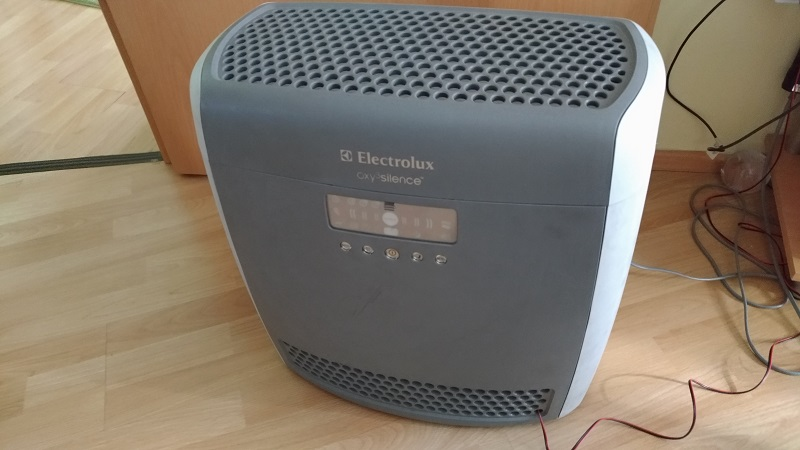

<h3>Created by Tamás Szabó</h3>

  28.05.2020

  E-mail: szabotamas6@gmail.com
  
  -Arduino Nano Electrolux Oxy3 air purifier control
  
  
Timing and adjasting the RPM of the purifier

        
  
  <h3>For this project you need:</h3>
  <ol>
   <li>Arduino (from size point of view I prefer NANO but other types can be good)</li>
   <li>Electric box</li>
   <li>3pcs of 1K or 10K Ohm resistors</li>
   <li>2pcs 2 digits display (ON/OFF or 0/1)</li>
   <li>2pcs of relays</li>
   <li>jumper wires</li>
   <li>2pc push button</li>
   <li>1pcs of LED for millis safety time</li>
   <li>1.5m low electric 2 chanel wire</li>
</ol>

   

