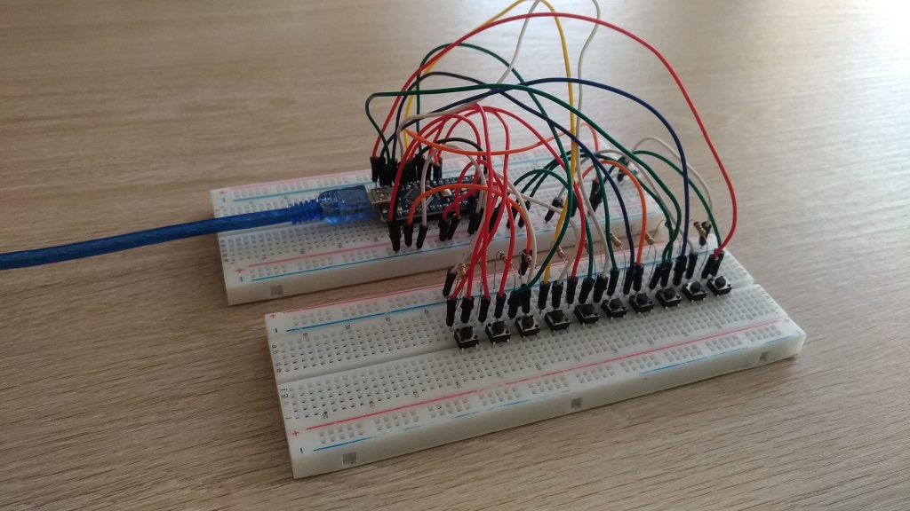
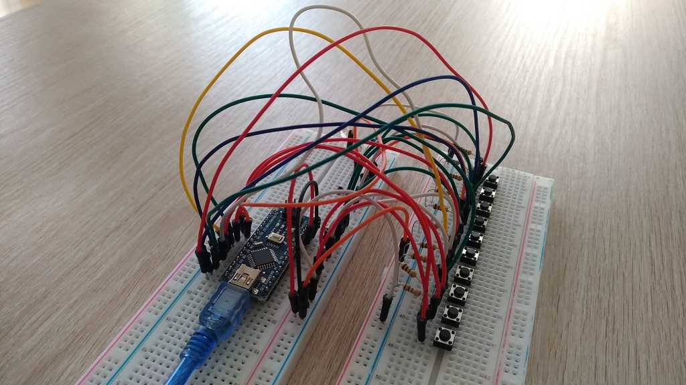
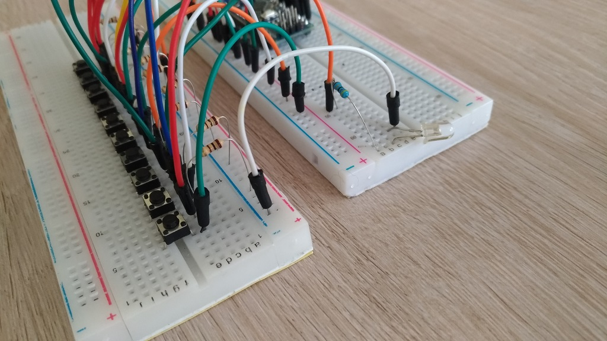
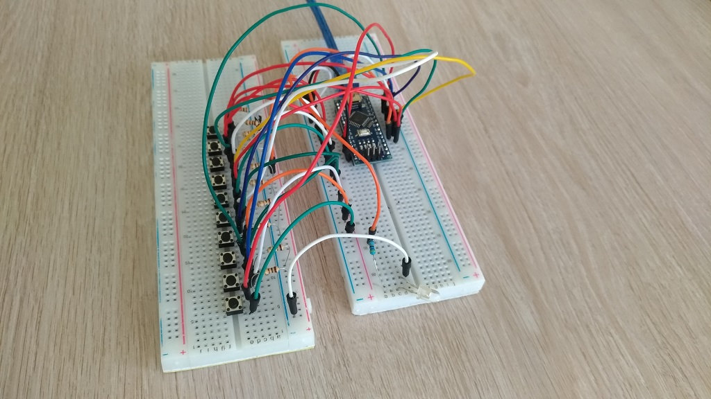
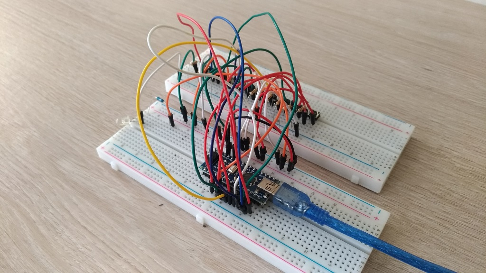

<h3>Created by Tamás Szabó</h3>

  13.04.2020

  E-mail: szabotamas6@gmail.com
  
  -IR Transmitter for Samsung TV remote controller
  
  
-Main buttons like:   Power, Source, Volume UP, Volume DOWN, Control arrows, OK (middle) button, Return

  
  Tested on: 
  SAMSUNG LE40B530p7; 
  SAMSUNG UE43NV7122
            
<h2>Samsung remote controller clone with arduino.</h2>

I am using Arduino NANO
  
  For this project you need:
  
    1. Arduino (from size point of view I prefer NANO but other types can be good
    
    2. 10pcs of push-buttons
    
    3. 10pcs of 1K or 10K Ohm resistors
    
    4. IR LED
    
    5  50 Ohm resistor
    
    6. 20+ jumper wires

Right now I am ready with the breadboard version and I will make the normal PCB version too shortly.

   
 
 

